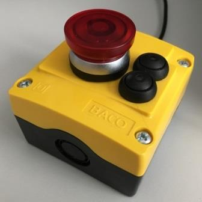

## USB Lock Key

The USB Lock Key is in fact a keyboard device with the intention to lock a (Windows) PC by hitting an emergency stop button. During the development more ideas came up, such as sending the PC to Hibernation mode with another dedicated key, as well as a Play/Pause button to quickly stop music when the telephone rings.

#### Features
* Lock Windows (Win+L)
* Windows Hibernation
* Music: Play/Pause
* Music: Next track (on double-click)

#### Hardware

The hardware platform used are ATmega32U4 based µC boards, like the Arduino Micro.
Other similar boards like e.g. the Adafruit Feather 32U4 could be used, however GPIO configuration may be adapted.

For pin mapping see source code.

#### Software

The software is a "native" application, means it works without the Arduino software framework.
Thus, the Atmel DFU Bootloader is in use instead of the Arduino bootloader.
USB functionality is handled by LUFA library by Dean Camera (https://www.lufa-lib.org).

#### Setup

1. Build project with Atmel Studio 7.0
2. Get the megaAVR DFU USB Bootloader from the Microchip website
   https://ww1.microchip.com/downloads/en/DeviceDoc/megaUSB_DFU_Bootloaders.zip
3. Connect (ISP) programmer to the board
4. Erase chip
5. Flash bootloader hex file
6. Clear the BOOTRST fuse
7. Flash application binaries using the DFU bootloader

#### Bootloader

The bootloader is started when one of the switches is pressed during µC reset or power on (see source code). This allows an easy firmware update without opening the device enclosure.